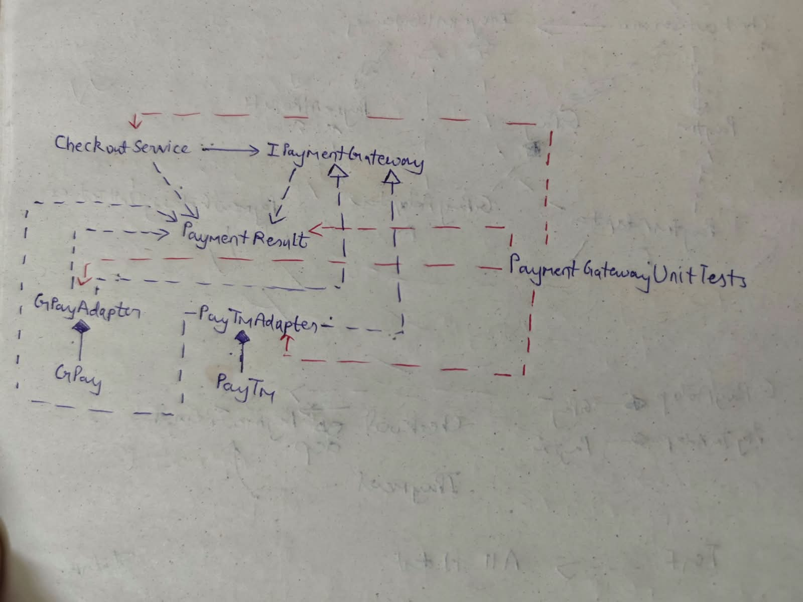

# A11 - Payment Gateway Adapter

> Present two incompatible payment gateway APIs through one checkout-facing interface.

## Problem Statement

The application needs to support multiple payment gateways through a single checkout-facing interface. The available payment gateways have different and incompatible APIs.

The two payment gateways are:

- `GPay`, which provides a `MakePayment(decimal amount)` method.
- `PayTm`, which provides a `SendMoney(decimal amount)` method.

Neither of these classes implement the common `IPaymentGateway` interface directly.

The **Adapter Pattern** is used to make both incompatible APIs compatible with a single checkout-facing interface without modifying the existing gateway classes.

---
## Design Overview

### UML Diagram

The **Adapter Pattern** is used to allow the incompatible `GPay` and `PayTm` classes to be used through a common interface.The checkout layer depends only on `IPaymentGateway`. The adapters implement this interface and internally translate the common `Pay()` call into the appropriate method of the payment gateway.

## Components
IPaymentGateway -> shared payment contract used by CheckoutService. Both adapters implement this interface.

PaymentResult ->provides a common representation of the outcome of a payment.

The result contains:
Succeeded - indicates whether the payment was successful.
Reference - contains the payment reference returned by the gateway.

GPay -> It exposes its own payment API `MakePayment(decimal amount)`. It does not implement IPaymentGateway. 

GPayAdapter -> implements IPaymentGateway and adapts the GPay API to the common payment contract.

PayTm -> It also does not implement IPaymentGateway.

PayTmAdapter -> implements IPaymentGateway and adapts calls from the common Pay() method to the legacy PayTm.SendMoney() method.

CheckoutService : the checkout-facing component.It depends on the interface IPaymentGateway rather than directly depending on GPay or PayTm. Therefore, the gateway can be changed without changing the checkout logic.

## Error Handling

The payment gateways can fail when an invalid amount is supplied. A non positive payment amount is considered invalid. The adapters handle exceptions raised by the  gateway and convert the failure into an unsuccessful PaymentResult.

## Build

The project targets .NET 8.
Build the solution using: `dotnet build`
## Testing

The project uses MSTest for unit testing.
The test project acts as the executive for the implementation, so a separate console application is not required for running the tests.
Run all unit tests using: `dotnet test`

## Test Summary

The unit tests verify both payment gateway adapters and their success and failure behavior. A valid positive payment amount is passed through the checkout service.

The tests verify that:
The payment succeeds.
The appropriate payment reference is returned.
The adapter correctly calls the underlying gateway.

## Non positive Amount

A non positive amount is passed to the checkout service.

The tests verify that:
Failure is handled by the adapter.
The adapter returns an unsuccessful PaymentResult.
**The current implementation zero amount to be invalid.**

## Critical Analysis

### Advantages
1.CheckoutService depends on IPaymentGateway rather than directly depending on a specific payment gateway.This reduces coupling between the checkout logic and individual payment providers.

2. The GPay and PayTm classes can remain unchanged. The adapters provide compatibility with the new interface without modifying their implementations. This is particularly useful when working with third-party or existing code that cannot easily be modified.

3. Both payment gateways can be accessed through `IPaymentGateway`. The checkout service therefore has one consistent API regardless of the  gateway.

4. Both adapters return: `PaymentResult` . This prevents the rest of the application from having to understand gateway-specific success and failure representations.

5. If another payment gateway with an incompatible API needs to be added, a new adapter implementing IPaymentGateway can be created. CheckoutService does not need to be modified.

### Limitations
1. No. of adapters will increase as the no. of gateways will increase.
2. The current implementation converts gateway exceptions into a simple unsuccessful PaymentResult. it can hide useful information about why the payment failed. Production code should produce more detailed error.
3. The payment gateways in this assignment are simplified implementations.
4. If a gateway api has significantly different behavior or requires multiple operations to perform one payment, the adapter can become more complicated.